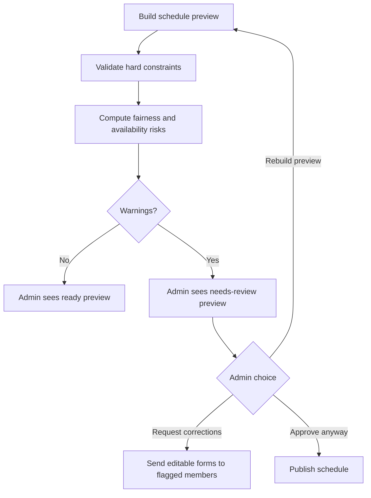

# Scheduling Rules

This document is the business source of truth for monthly adhoc scheduling.
Rules are grouped by type so humans and agents can change or audit the scheduler
without reading the whole codebase first.

## Rule Types

| Type | Meaning |
|---|---|
| Hard constraint | Must be satisfied. If impossible, the preview must warn the admin. |
| Weighted fairness rule | Should be optimized with a weight. Can be traded off against other soft rules. |
| Admin review warning | Does not block approval, but must be visible before publishing. |

## Hard Constraints

- Fridays are not scheduled.
- Every non-Friday workday must have a main adhoc owner.
- Every non-Friday workday must have a backup.
- A member unavailable on a specific date or weekday must not be assigned on
  that day, either as main or backup.
- Main and backup should be different people.
- Exception: if exactly one member is available for a day, that same member must
  be assigned as both main and backup rather than leaving backup empty.

## Weighted Fairness Rules

- Main adhoc is heavier than backup and must carry higher fairness weight.
- Backup should still be distributed fairly, with lower weight than main.
- Thursdays have the highest weekday weight because they are harder days.
- Thursday main ownership must be fair across the recent 2-3 month window.
- Thursday backup ownership should also be spread, with lower weight than
  Thursday main.
- Saturdays are usually bug-heavy and should be spread across people.
- Consecutive assignments should be avoided when possible.
- A person assigned today should preferably not be assigned tomorrow or the day
  after.
- Weekday ownership should rotate so one person does not repeatedly get the same
  weekday.
- Fairness must consider recent history, not only the current month.

## Availability And Fairness Warnings

If one or more members mark themselves unavailable so much that the schedule
cannot be fair, the admin preview must show a short warning.

The warning should:

- name the affected members;
- show how many workdays they are available for;
- explain that the bot may not be able to build a fair schedule;
- keep approval possible;
- allow the admin to request corrections and resend forms to those members.

Examples:

- A member is available for only 1 out of 26 workdays.
- A member has fewer available days than their expected fair main share.
- A member is unavailable for most of the month and this creates visible main
  assignment imbalance.

## Review Flow

## Implementation Notes

- Rule weights should live outside the main scheduling loop when practical.
- Preview output should include both human-readable text and structured
  `review_json`.
- Tests should cover hard constraints, Thursday fairness, Saturday spreading,
  spacing, history-aware fairness, and admin warnings for extreme
  unavailability.
