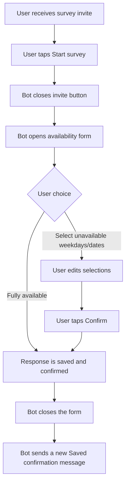
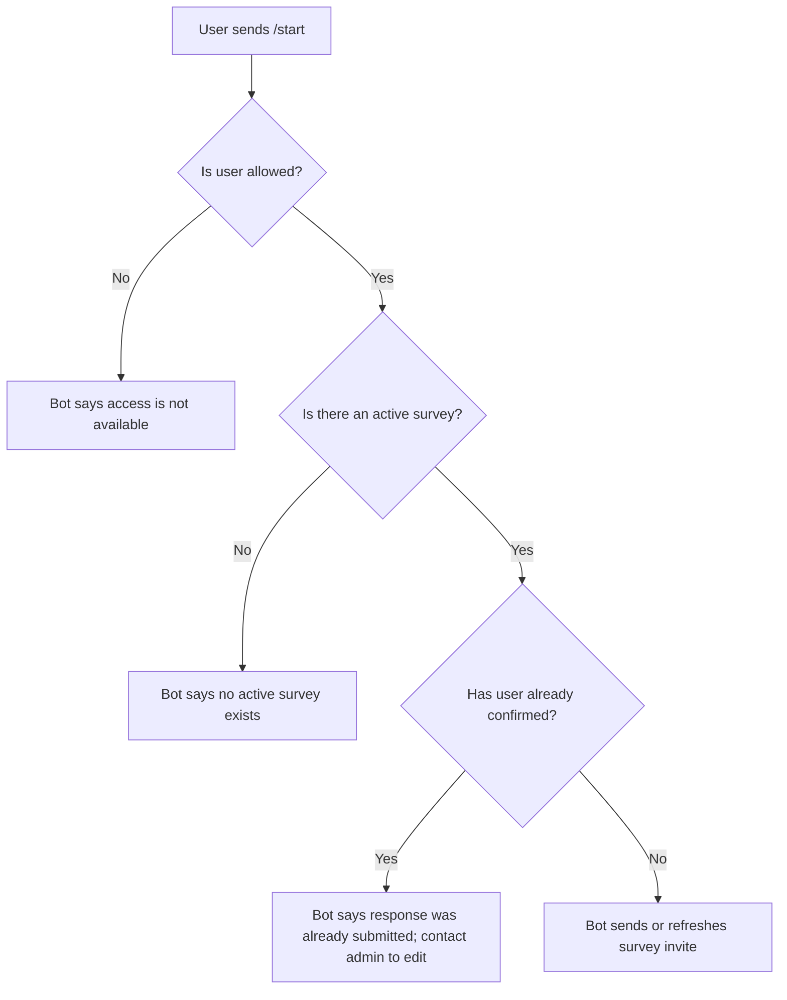
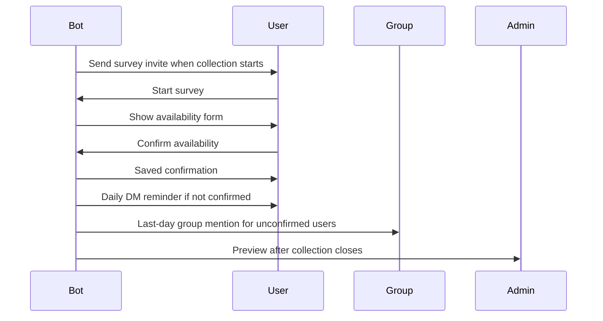
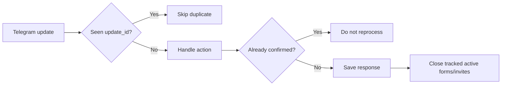

# Regular User Business Flow

This document describes the business flow for a regular Telegram user in the
Adhoc Assistant bot. It is intentionally short and structured so both humans and
agents can quickly understand the expected behavior.

## Scope

- Actor: a regular team member, not an admin.
- Channel: direct chat with the Telegram bot.
- Main goal: submit monthly availability for the adhoc schedule.
- Source of truth: the bot database, especially users, surveys, participants,
  responses, and tracked Telegram messages.

## Happy Path

## Access And Start Flow

## Survey Interaction Rules

| Situation | Expected behavior |
|---|---|
| User taps the invite start button | Invite button is closed, then the availability form opens. |
| User marks fully available | Response is confirmed immediately, the form closes, and a saved message is sent. |
| User selects weekdays and/or dates | Both selection types may be combined before confirm. |
| User taps confirm | Response is confirmed, the form closes, and a saved message is sent. |
| User taps an old form after confirming | Bot must not process the response again; it should say the response was already submitted. |
| User taps an old form before confirming and survey is still open | Bot may process the action and continue the form. |
| User taps a form after the survey closes | Bot says the survey window is closed and suggests contacting an admin. |
| User is not allowed to use the bot | Bot says access is unavailable without exposing admin/owner details. |

## Collection Window

## Deadline Behavior

- During the collection window, only unconfirmed participants should receive
  reminders.
- On the last day, unconfirmed participants may be mentioned in the configured
  group/topic.
- When the collection window ends, missing responses are treated as fully
  available unless an admin updates them manually.
- After the deadline, regular users should not be able to submit a normal
  response through stale survey buttons.

## Admin-Triggered Exceptions

Regular users normally cannot edit a confirmed response by themselves. Admins
can still intervene through explicit commands:

- resend a fresh editable form to a selected user;
- update a user's survey availability directly during collection;
- update an already-published schedule entry during the month;
- remove a participant from the current survey;
- deactivate a user for future surveys.

When an admin resends a fresh editable form, the new submission may overwrite
the previous survey response for that user and survey.

## Idempotency And Message Handling

Business requirements:

- A Telegram update must not be processed twice.
- A confirmed survey response must not be accidentally submitted twice.
- Old form and invite messages should be closed best-effort.
- Survey messages are tracked per survey and per user so interactions stay tied
  to the correct survey.
- If the service crashes, duplicate updates should be skipped after restart when
  they were already recorded as processed.

## Data Ownership

| Data | Meaning |
|---|---|
| User | A Telegram account known to the bot, with access and active status. |
| Survey | One monthly availability collection cycle. |
| Participant | A user expected to answer a specific survey. |
| Response | A user's availability for one survey. |
| Survey message | Telegram invite/form message tied to one survey and user. |
| Schedule entry | Final per-day adhoc assignment after admin approval/publish. |

## Non-Goals For Regular Users

- Regular users do not approve previews.
- Regular users do not publish schedules.
- Regular users do not change bot runtime settings.
- Regular users do not see admin identity or ownership details when access is
  denied.
